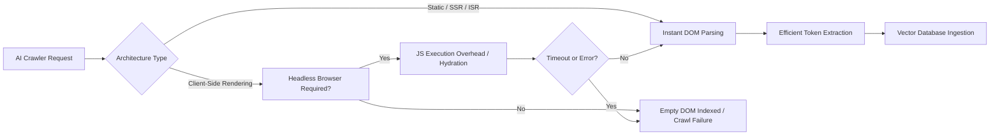

# Generative Engine Optimization (GEO) & LLM Optimization (LLMO)

## 1. EXECUTIVE SUMMARY & EVOLUTION OF AI SEARCH

### Summary

- **What this is:** A strategic framework for adapting enterprise digital infrastructure to be discoverable and understandable by modern Artificial Intelligence engines like ChatGPT, Gemini, and Claude.
- **Why it matters:** Traditional search is being rapidly replaced by conversational AI. Being "invisible" to AI means losing your audience, as users bypass traditional search engine result pages (SERPs) for direct answers.
- **Business value:** Guarantees your brand, products, and intellectual property are cited as authoritative sources in AI-generated answers, driving high-intent traffic and maintaining market dominance.
- **Risks of ignoring it:** Complete erasure from the next generation of digital discovery. Competitors who optimize for AI will capture your market share, as AI engines will confidently state your competitors' solutions as the only options.

### The Evolution of Discovery: From Index Cards to Analysts

To understand Generative Engine Optimization (GEO), we must recognize the fundamental shift in how information is retrieved and presented.

- **Phase 1: Library index cards (Traditional SEO):** Early search engines used Information Retrieval models like TF-IDF and BM25 to match keywords, utilizing PageRank and Link Equity to determine authority. You searched for a topic, and the engine gave you a list of "books" (links).
- **Phase 2: Knowledge assistants (AEO & Featured Snippets):** The transition phase introduced Answer Engine Optimization (AEO). Google introduced Featured Snippets and AI Overviews. The engine attempted to read the book and give you a highlighted paragraph.
- **Phase 3: Research analyst synthesizing thousands of documents (GEO & LLMO):** Modern Retrieval-Augmented Generation (RAG) and Semantic Search leverage Dense Vector Retrieval and Embeddings. The AI engine reads every book, synthesizes the information, performs Citation Selection, and delivers a Narrative Synthesis tailored to the exact user query.

### AI Search Architecture Comparison

| Capability | Traditional SEO (Phase 1) | Answer Engine Optimization (Phase 2) | GEO & LLMO (Phase 3) |
| :--- | :--- | :--- | :--- |
| **Core Matching** | Lexical / Keyword matching | Natural Language Processing (NLP) | Dense Vector Embeddings |
| **Ranking Factors** | Backlinks, Keyword Density | Schema, Q&A format | Semantic Density, Entity Authority |
| **Output Format** | List of 10 Blue Links | Direct answers + Links | Synthesized Narrative + Citations |
| **User Intent** | Navigation / Discovery | Quick factual answers | Complex problem solving |

---

## 2. ON-SITE INFRASTRUCTURE & MACHINE READABILITY

### Summary

- **What this is:** Re-architecting how your website's underlying code and server responses present data to automated AI crawlers (bots).
- **Why it matters:** AI crawlers process data differently than human browsers. If your site relies heavily on complex client-side rendering without fallback, bots see a blank page.
- **Business value:** Ensures 100% of your valuable content is successfully ingested into the vector databases that power LLMs, maximizing your chances of citation.
- **Risks of ignoring it:** If an AI bot cannot parse your site efficiently, it will abandon the crawl. Your content will literally not exist within the AI's knowledge base.

### 2A. llms.txt

### Summary

- **What this is:** A new, standardized plain-text file placed in the root of a domain (e.g., `example.com/llms.txt`) designed specifically to guide LLMs and AI agents on how to read the site.
- **Why it matters:** It provides a highly condensed, token-efficient map of your site's most important factual information and markdown-formatted documentation.
- **Business value:** Drastically lowers the computing cost for AI companies to ingest your data, making them more likely to index you frequently and accurately.
- **Risks of ignoring it:** AI bots may scrape irrelevant navigation menus or footer text instead of your core content, diluting your semantic relevance.

#### Implementation & Architecture

**Classification:** Community Convention ★★★☆☆

The `llms.txt` file is an emerging community convention designed to provide a markdown-friendly index for LLM web crawlers.

- **Purpose:** To explicitly point AI crawlers to the most token-efficient, high-value content on your site, bypassing CSS, JavaScript, and complex DOM structures.
- **Current Status:** Rapidly gaining adoption among developer documentation sites and forward-thinking enterprises.
- **Limitations:** Not an official IETF standard. It relies on voluntary compliance by bot operators.
- **Versioning:** Currently unstructured, but best practices dictate treating it similarly to a sitemap index.
- **Maintenance:** Requires manual updating alongside standard XML Sitemaps.

**Comparison:**

| Feature | `robots.txt` | `llms.txt` | `llms-full.txt` |
| :--- | :--- | :--- | :--- |
| **Target** | All Web Crawlers | LLMs / AI Agents | LLMs / AI Agents |
| **Purpose** | Allow/Disallow crawling | Directory of markdown docs | Concatenated full content |
| **Format** | Specific directives | Markdown links | Markdown text |
| **Status** | Official Standard ★★★★★ | Community Convention ★★★☆☆ | Experimental Practice ★★☆☆☆ |

**Production-Ready Example (`llms.txt`):**

```markdown
# Enterprise Corp Documentation
> Welcome to the AI-optimized index for Enterprise Corp.

## Core Products
- [Cloud Architecture Guide](https://example.com/docs/cloud.md)
- [API Reference](https://example.com/docs/api.md)

## Company Information
- [About Us](https://example.com/about.md)
```

### 2B. DOM Architecture

### Summary

- **What this is:** The structural foundation of your website's code (Document Object Model) and how pages are rendered to the visitor or bot.
- **Why it matters:** AI bots often lack the computing power (or patience) to execute heavy JavaScript just to read text. They prefer static HTML.
- **Business value:** Clean, pre-rendered architecture guarantees indexability across all AI platforms, regardless of their JavaScript execution capabilities.
- **Risks of ignoring it:** "Client-Side Rendering" (CSR) can result in AI bots indexing an empty `<div id="root"></div>`, completely erasing your brand from their memory.

#### Architectural Breakdown

**Classification:** Official Standard ★★★★★

AI crawlers must balance scale with compute costs. Consequently, they prioritize **token efficiency** and fast **DOM parsing**. When a bot encounters a site, JavaScript rendering failures are common if the bot does not run a headless browser.

- **Server-Side Rendering (SSR) & Static Generation (SSG):** The server sends a fully populated HTML document. This is highly preferred for AI crawlability. Frameworks like Next.js and Astro excel here.
- **Client-Side Rendering (CSR):** The browser (or bot) must download, parse, and execute a JavaScript bundle (React, Vue) to generate the HTML (Hydration). This is dangerous for GEO.
- **Incremental Static Regeneration (ISR):** A hybrid approach where pages are built statically but updated incrementally in the background.

**Rendering Strategy Comparison:**

| Architecture | AI Crawlability | Token Efficiency | Examples |
| :--- | :--- | :--- | :--- |
| **Static Generation (SSG)** | Excellent ★★★★★ | High | Astro, Next.js |
| **Server-Side Rendering (SSR)** | Excellent ★★★★★ | High | Next.js, Nuxt |
| **Client-Side Rendering (CSR)** | Poor ★☆☆☆☆ | Low (JS bloat) | React SPA |
| **Incremental Static Regeneration**| Excellent ★★★★★ | High | Next.js |




**Implementation Directives:**
- Maintain strict **semantic HTML** (`<article>`, `<main>`, `<aside>`) to ensure content accessibility.
- Enforce a strict **heading hierarchy** (H1 -> H2 -> H3) without skipping levels. This defines the document's logical structure for chunking.
- Ensure **navigation structure** uses standard `<nav>` elements, allowing bots to distinguish core content from boilerplate.
- Implement **lazy loading** only for images below the fold, never for primary text content.

### 2C. Semantic Layer

### Summary

- **What this is:** Adding hidden, highly structured data (JSON-LD) to your web pages that explicitly tells the AI exactly what the page is about.
- **Why it matters:** Instead of forcing the AI to guess relationships by reading text, the semantic layer spoon-feeds the AI entities, facts, and relationships in a standardized format.
- **Business value:** Directly populates Enterprise Knowledge Graphs, ensuring your company is explicitly linked to your key products, executives, and services.
- **Risks of ignoring it:** The AI may misinterpret your content, attribute your achievements to competitors, or fail to understand the specific specifications of your products.

#### Implementation & Architecture

**Classification:** Official Standard ★★★★★ (Schema.org)

The Semantic Layer relies on **entity extraction** and **knowledge graph construction**. By implementing JSON-LD, you bypass the ambiguity of natural language processing and explicitly define relationships through **disambiguation** and **preprocessing**.

**Production-Ready JSON-LD Examples:**

**Organization, WebSite, & LocalBusiness:**
```json
<script type="application/ld+json">
{
  "@context": "https://schema.org",
  "@type": "Organization",
  "name": "Enterprise Corp",
  "url": "https://www.example.com",
  "logo": "https://www.example.com/logo.png",
  "sameAs": [
    "https://www.linkedin.com/company/enterprise-corp"
  ],
  "contactPoint": {
    "@type": "ContactPoint",
    "telephone": "+1-800-555-1212",
    "contactType": "Customer Service"
  }
}
</script>
```

**FAQPage (Critical for LLM training and AEO):**
```json
<script type="application/ld+json">
{
  "@context": "https://schema.org",
  "@type": "FAQPage",
  "mainEntity": [{
    "@type": "Question",
    "name": "What is Generative Engine Optimization (GEO)?",
    "acceptedAnswer": {
      "@type": "Answer",
      "text": "GEO is the practice of optimizing content and infrastructure to be discoverable by Large Language Models and AI-driven search engines."
    }
  }]
}
</script>
```

**Product & Review:**
```json
<script type="application/ld+json">
{
  "@context": "https://schema.org/",
  "@type": "Product",
  "name": "Enterprise Cloud Platform",
  "description": "High-performance AI cloud compute.",
  "review": {
    "@type": "Review",
    "reviewRating": {
      "@type": "Rating",
      "ratingValue": "5",
      "bestRating": "5"
    },
    "author": {
      "@type": "Person",
      "name": "Jane Doe"
    }
  }
}
</script>
```

**BreadcrumbList & Article:**
Use these schemas to map the hierarchy and authorship of deep content clearly to the AI.

---

## 3. CONTENT ENGINEERING

### Summary

- **What this is:** Structuring the actual words, sentences, and paragraphs of your content specifically to match how AI systems process language.
- **Why it matters:** AI models break documents into small "chunks" and convert them into math (vectors). If your main point is buried in paragraph four, the AI might discard it.
- **Business value:** Guarantees your brand's unique insights survive the AI's internal processing, maximizing the chance your content is retrieved to answer a user's prompt.
- **Risks of ignoring it:** Beautifully written marketing copy with high "fluff" will be ignored by vector databases because its "semantic density" is too low.

### Direct Answer First & High-Density Information

**Classification:** Industry Consensus ★★★★☆

Modern RAG systems utilize **vector retrieval**. Content is divided into segments (**chunking**), converted into **embeddings**, and matched against user prompts using **cosine similarity**.

- **Token Windows:** Models have limited context windows. They prefer **semantic density**—high information value per token.
- **Retrieval Scoring:** **Passage ranking** algorithms favor chunks that directly answer the prompt without preamble.
- **Direct Answer First (BLUF):** Always place the most critical factual answer in the first 50 words of a document or section. If a chunk begins with a long anecdote, it may be scored lower for relevance and discarded during retrieval.

**Why High-Density Information Survives Chunking:**
LLMs are trained to seek information entropy. The following formats inherently possess high semantic density and survive the chunking process exceptionally well:

1. **Comparison Tables:** Highly structured entity relationships.
2. **Statistics & Benchmarks:** Explicit factual data.
3. **Expert Quotations:** Authoritative statements tied to a specific entity.
4. **Markdown Structured Lists:** Clear hierarchical data boundaries.
5. **FAQs:** Perfectly formatted for Q&A embeddings.

Redundancy is the enemy of token efficiency. Originality and high-density formatting ensure that when your document is sliced into 512-token chunks, every single chunk contains valuable, retrievable facts.

---

## 4. USER AGENTS & FIREWALLS

### Summary

- **What this is:** Identifying and managing the specific automated programs (bots) deployed by AI companies to index the web.
- **Why it matters:** Standard firewall configurations treat aggressive AI crawlers like DDoS attacks or scrapers, blocking them entirely.
- **Business value:** Guarantees that valuable enterprise content is accessible to legitimate AI models while protecting against rogue scrapers.
- **Risks of ignoring it:** The AI engine simply cannot reach your site. Your content remains unindexed and your competitors take precedence.

### Firewalls & Bot Management

**Classification:** Industry Consensus ★★★★☆

AI companies utilize specific user agents for their web crawlers. These include:

- `GPTBot` (OpenAI training)
- `ChatGPT-User` (ChatGPT real-time browsing)
- `ClaudeBot` (Anthropic training)
- `Claude-User` (Claude real-time browsing)
- `PerplexityBot` (Perplexity AI)
- `Google-Extended` (Google AI training)
- `Googlebot` (Google general indexing)
- `Bingbot` (Microsoft Copilot)

**Implementation Directives:**
1. **robots.txt:** Explicitly define allow/disallow rules for these specific bots.
2. **Cloudflare WAF / Bot Management:** Many default WAF rules flag these bots as "Automated Traffic" or "Scrapers" and issue CAPTCHAs or `403 Forbidden` errors. AI bots cannot solve CAPTCHAs.
3. **Rate Limiting:** Instead of blocking, apply rate limiting to prevent infrastructure overload while allowing the crawl to succeed.
4. **Abuse Mitigation vs Authenticated Crawlers:** Implement reverse DNS lookup or IP validation to verify that a crawler claiming to be `GPTBot` actually originates from OpenAI's ASNs.

**Production-Ready Example (Cloudflare WAF Rule):**

```bash
(http.user_agent contains "GPTBot" and ip.geoip.asnum == 398722) 
or 
(http.user_agent contains "Google-Extended" and ip.geoip.asnum == 15169)
# Action: Skip -> Bot Fight Mode
```

**Production-Ready Example (Nginx):**

```nginx
map $http_user_agent $is_ai_bot {
    default 0;
    "~*GPTBot" 1;
    "~*ClaudeBot" 1;
    "~*PerplexityBot" 1;
}

server {
    location / {
        if ($is_ai_bot) {
            # Allow access without aggressive rate limiting
            break;
        }
    }
}
```

**Production-Ready Example (Apache):**

```apache
SetEnvIfNoCase User-Agent "GPTBot" ai_crawler
SetEnvIfNoCase User-Agent "ClaudeBot" ai_crawler
SetEnvIfNoCase User-Agent "PerplexityBot" ai_crawler

<RequireAll>
    Require all granted
    # Avoid blocking these specific env variables in firewall rules downstream
</RequireAll>
```

---

## 5. ANALYTICS & GEO METRICS

### Summary

- **What this is:** The new methodologies and software platforms required to measure how often and how favorably your brand appears in AI-generated answers.
- **Why it matters:** You cannot optimize what you cannot measure. "Keyword rankings" (position 1-10 on a SERP) are becoming obsolete.
- **Business value:** Provides actionable data to leadership demonstrating ROI on GEO efforts and identifying critical gaps in AI visibility.
- **Risks of ignoring it:** Flying blind. You may assume your SEO dominance translates to AI dominance, only to discover you have zero visibility in ChatGPT.

### The Shift in Measurement Paradigm

**Classification:** Emerging Best Practice ★★★☆☆

The traditional metric of SEO success is dead. Organizations must shift their analytics framework:

Keyword Rankings
↓
Citation Visibility
↓
Share of Voice
↓
AI Presence

Modern tracking platforms, such as **Semrush Enterprise AIO** and the **Semrush AI Visibility Toolkit**, are shifting from tracking URLs to tracking entities and narrative inclusion.

**Core Metrics to Discuss:**
- **Prompt Monitoring:** Tracking high-value conversational queries rather than short-tail keywords.
- **AI Citations:** Counting the absolute number of times your brand is cited as a source in an AI response.
- **Entity Coverage:** How well the AI associates your brand with specific unbranded entities.
- **Topical Authority:** The AI's internal confidence score in your brand for a given topic.
- **Competitor Benchmarking:** Tracking Share of Voice against competitors in AI answers.
- **Sentiment Analysis:** Evaluating whether the AI's description of your brand is positive, neutral, or negative.
- **Citation Attribution:** Understanding which specific piece of your content triggered the citation.
- **Prompt Clusters:** Grouping related conversational queries to understand broader user intent.
- **AI Visibility Scoring:** A composite metric aggregating citations, sentiment, and entity coverage.

### KPI Dashboards

A GEO dashboard must visualize **Citation Visibility** alongside **AI Crawler Logs** (proving ingestion) and **Sentiment**. 

---

## 6. IMPLEMENTATION ROADMAP

### Summary

- **What this is:** A prioritized, step-by-step 90-day plan to transform your digital presence for the AI era.
- **Why it matters:** Cross-functional alignment is essential. GEO touches engineering, content, and security.
- **Business value:** Delivers immediate quick wins (e.g., `llms.txt`) while structuring long-term architectural shifts (e.g., Semantic Layer).
- **Risks of ignoring it:** Disjointed efforts resulting in blocked crawlers or wasted content engineering budgets.

### 30-Day Plan: Discovery & Quick Wins

- **Task:** Implement `llms.txt` and `robots.txt` AI updates
  - **Owner:** Engineering
  - **Effort:** Low
  - **Dependencies:** None
  - **Expected ROI:** Immediate indexability improvements
  - **Business Impact:** High
  - **Engineering Complexity:** Low
  - **Implementation Risk:** Low
- **Task:** Audit WAF & Bot Management for AI crawler blocking
  - **Owner:** Operations
  - **Effort:** Low
  - **Dependencies:** Security Approval
  - **Expected ROI:** Unblocks AI ingestion
  - **Business Impact:** High
  - **Engineering Complexity:** Low
  - **Implementation Risk:** Low

### 60-Day Plan: Structural Integrity

- **Task:** Deploy Core JSON-LD Schemas (Organization, Product, FAQPage)
  - **Owner:** Marketing
  - **Effort:** Medium
  - **Dependencies:** CMS Architecture
  - **Expected ROI:** Entity disambiguation
  - **Business Impact:** Medium
  - **Engineering Complexity:** Medium
  - **Implementation Risk:** Low
- **Task:** Transition heavy CSR pages to SSR/SSG (if applicable)
  - **Owner:** Engineering
  - **Effort:** High
  - **Dependencies:** Infrastructure
  - **Expected ROI:** Guaranteed indexing
  - **Business Impact:** High
  - **Engineering Complexity:** High
  - **Implementation Risk:** Medium

### 90-Day Plan: Content & Analytics

- **Task:** Content Chunking Audit (Direct Answer First)
  - **Owner:** Content
  - **Effort:** Medium
  - **Dependencies:** None
  - **Expected ROI:** Improved retrieval scoring
  - **Business Impact:** High
  - **Engineering Complexity:** Low
  - **Implementation Risk:** Low
- **Task:** Deploy AI Visibility Tracking
  - **Owner:** Leadership
  - **Effort:** Low
  - **Dependencies:** Budget Approval
  - **Expected ROI:** Measurable KPIs
  - **Business Impact:** High
  - **Engineering Complexity:** Low
  - **Implementation Risk:** Low

---

## 7. RISK ASSESSMENT

### Summary

- **What this is:** Identifying the potential pitfalls of optimizing for AI search engines.
- **Why it matters:** AI models hallucinate, misinterpret data, and sometimes bypass copyright intent.
- **Business value:** Protects brand reputation and prevents intellectual property leakage while pursuing AI visibility.
- **Risks of ignoring it:** You might successfully optimize your site, only to find the AI hallucinating false product specifications and presenting them as facts under your brand name.

### Risk Management Matrix

**Classification:** Official Standard ★★★★★

When opening enterprise architecture to AI crawlers, organizations must implement robust mitigation strategies.

| Risk | Likelihood | Impact | Mitigation Strategy |
| :--- | :--- | :--- | :--- |
| **AI Crawler Blocking (WAF)** | High | High | Whitelist verified AI crawler IPs via reverse DNS; use rate limiting instead of blocking. |
| **Duplicate Content / Scraping** | High | Medium | Implement strict Canonical URLs and restrict API access to authenticated models. |
| **Hallucinated Citations** | Medium | High | Utilize dense, unambiguous JSON-LD and provide clear, simple text blocks to minimize inference errors. |
| **Outdated Structured Data** | Medium | High | Automate JSON-LD generation directly from the master PIM (Product Information Management) database. |
| **Broken Canonical URLs** | Low | Medium | Strict CI/CD checks for `<link rel="canonical">` before deployment. |
| **JavaScript Rendering Failures** | High | High | Transition critical conversion pages to Server-Side Rendering (SSR) or Static Generation. |

---

## 8. KPI FRAMEWORK

### Summary

- **What this is:** The specific, measurable data points used to track the success of your Generative Engine Optimization.
- **Why it matters:** Without specific KPIs, GEO becomes a guessing game without accountability.
- **Business value:** Justifies budget allocation and provides clear targets for the engineering and content teams.
- **Risks of ignoring it:** Spending millions on infrastructure updates with no empirical way to prove it increased your AI visibility.

### Measurable Performance Indicators

**Classification:** Industry Consensus ★★★★☆

- **AI Visibility Score:** A composite metric from platforms like Semrush AIO. Measured by aggregating citation frequency, ranking position (if applicable), and entity presence.
- **Share of AI Voice:** The percentage of times your brand is cited compared to your top 3 competitors for a specific prompt cluster. Measured via automated prompt testing scripts.
- **Citation Growth:** The week-over-week percentage increase in absolute citations across ChatGPT, Gemini, and Claude.
- **Prompt Coverage:** The percentage of your targeted "user intents" that result in a favorable AI response. Measured by mapping a list of 500+ questions to AI output.
- **Structured Data Coverage:** The percentage of total pages containing valid, error-free JSON-LD. Measured via regular site crawls (e.g., Screaming Frog).
- **Entity Recognition Accuracy:** How often the AI correctly attributes specific facts to your brand (e.g., pricing, features). Measured by manual or automated NLP sampling.
- **Semantic Recall:** The likelihood that an AI will retrieve your document when asked a highly specific, long-tail question.
- **Chunk Readability Score:** Evaluating the semantic density of content chunks before deployment. Measured using NLP analysis tools.
- **Crawl Success Rate:** The percentage of successful (HTTP 200) requests from known AI user agents (`GPTBot`, etc.). Measured via server log analysis.
- **Citation CTR:** The click-through rate from an AI citation link back to your website. Measured via UTM parameters or referer data (where available).

---

## 9. ENTERPRISE MATURITY MODEL

### Summary

- **What this is:** A five-level framework assessing an organization's readiness and execution of AI optimization.
- **Why it matters:** It provides a clear roadmap, identifying exactly where your organization stands today and what capabilities you need to build next.
- **Business value:** Allows leadership to set realistic, stage-appropriate goals rather than attempting advanced AI integrations before fixing basic crawlability.
- **Risks of ignoring it:** Attempting "Level 5" AI Native strategies while your infrastructure is still at "Level 0" (Invisible), leading to spectacular failure and wasted resources.

### The Five Levels of GEO Maturity

**Classification:** Industry Consensus ★★★★☆

**Level 0: Invisible to AI**
- **Characteristics:** Heavy client-side rendering (SPA), aggressive WAF blocking all bots, zero structured data.
- **KPIs:** 0% AI Visibility.
- **Infrastructure:** React/Vue CSR without pre-rendering, default Cloudflare bot-fight mode.
- **Organizational Capabilities:** Disconnected SEO and Engineering teams.

↓

**Level 1: Search Optimized (Traditional SEO)**
- **Characteristics:** Good keyword rankings, basic XML sitemaps, readable HTML, but content is fluffy and not semantically dense.
- **KPIs:** High organic traffic, low AI citations.
- **Infrastructure:** Standard CMS (WordPress, Drupal).
- **Organizational Capabilities:** Strong SEO team, but unaware of RAG mechanisms.

↓

**Level 2: Machine Readable**
- **Characteristics:** `llms.txt` deployed, WAF explicitly allows AI bots, basic JSON-LD (Organization) implemented.
- **KPIs:** 100% Crawl Success Rate from AI bots.
- **Infrastructure:** Verified bot whitelisting, SSR implemented for core pages.
- **Organizational Capabilities:** Engineering and Security collaborate on bot management.

↓

**Level 3: AI Discoverable**
- **Characteristics:** Deep JSON-LD implementation (FAQPage, Product), content restructured for Direct Answer First, Semantic HTML strictly enforced.
- **KPIs:** Growing Citation Visibility, positive Entity Recognition Accuracy.
- **Infrastructure:** Automated schema generation from databases.
- **Organizational Capabilities:** Content team writes for "semantic density" rather than keyword density.

↓

**Level 4: AI Optimized**
- **Characteristics:** Dedicated enterprise knowledge graph, real-time prompt monitoring, content chunking audits integrated into CI/CD.
- **KPIs:** Dominant Share of AI Voice in core industry topics.
- **Infrastructure:** API endpoints exposed directly to AI models (e.g., ChatGPT Plugins/Actions).
- **Organizational Capabilities:** Cross-functional GEO team (Content, Eng, Security, Data) meeting weekly.

↓

**Level 5: AI Native**
- **Characteristics:** Infrastructure designed entirely around LLM ingestion. The website is secondary to the API and knowledge graph. Proactive data feeding via Model Context Protocol (MCP).
- **KPIs:** The brand *becomes* the AI's default factual baseline for the industry.
- **Infrastructure:** Vector databases synchronize in real-time with public-facing documentation.
- **Organizational Capabilities:** Company is viewed as an AI data provider, not just a website publisher.

---

## 10. FUTURE OF GEO

### Summary

- **What this is:** A forward-looking projection of how Generative Engine Optimization will evolve over the next 24-60 months.
- **Why it matters:** Preparing your infrastructure today for where the puck is going tomorrow prevents expensive architectural refactoring.
- **Business value:** Secures first-mover advantage as AI shifts from passive answering to active, autonomous task execution.
- **Risks of ignoring it:** Building a Level 3 maturity system today that becomes instantly obsolete when AI Agents become the primary internet interface next year.

### The 2-5 Year Horizon

**Classification:** Informed Speculation ★☆☆☆☆ to Emerging Best Practice ★★★☆☆

The shift from Retrieval-Augmented Generation (RAG) to Autonomous Agents will redefine GEO.

- **Agentic Search (Informed Speculation ★☆☆☆☆):** Users won't ask "What is the best cloud platform?" They will say, "Analyze my AWS bill and migrate the most expensive services to a cheaper provider." To capture this intent, your APIs must be fully documented and accessible to AI agents.
- **AI Browsers (Emerging Best Practice ★★★☆☆):** Browsers (like Arc or Chrome with AI features) will synthesize web pages locally. Sites must be highly token-efficient and provide explicit semantic HTML to render correctly in these synthesized views.
- **Model Context Protocol (MCP) & OpenAI Connectors (Emerging Best Practice ★★★☆☆):** We will move beyond crawling. Enterprises will push their knowledge graphs directly into LLM context windows via standardized protocols (e.g., Anthropic's MCP).
- **Knowledge APIs (Informed Speculation ★☆☆☆☆):** Traditional websites will be secondary. The primary digital asset will be an authenticated GraphQL or REST endpoint designed exclusively for AI ingestion.
- **Autonomous Retrieval & Real-time Retrieval (Emerging Best Practice ★★★☆☆):** AI models will dynamically ping your APIs mid-generation to pull real-time pricing, stock, or documentation.
- **Multi-agent systems (Informed Speculation ★☆☆☆☆):** Swarms of specialized AI agents will negotiate with each other. Your site's semantic layer must be able to securely interact with these swarms to facilitate B2B transactions.
- **Enterprise Knowledge Graphs (Industry Consensus ★★★★☆):** The foundation of future GEO. An internal, interconnected map of all company data that can be queried securely by external LLMs.

---

## 11. COMMON MYTHS

### Summary

- **What this is:** Dispelling the dangerous misinformation currently circulating in traditional SEO circles regarding AI.
- **Why it matters:** Executive teams often base strategy on outdated or misunderstood technical mechanics.
- **Business value:** Prevents wasted budget on tactics that have zero impact on AI visibility.
- **Risks of ignoring it:** Focusing entirely on "keyword density" while your competitors are building JSON-LD knowledge graphs.

### Debunking GEO Misconceptions

**Classification:** Official Standard ★★★★★ (Based on known LLM mechanics)

**Myth: LLMs crawl exactly like Google.**
**Reality:** While Googlebot indexes for a SERP, AI bots (`GPTBot`) crawl for training data and real-time synthesis. They prioritize markdown, plain text, and semantic density over visual layout or backlink profiles.

**Myth: robots.txt controls ChatGPT responses.**
**Reality:** `robots.txt` only stops the *crawler*. If your data was ingested in 2022, or if it exists on third-party sites (like Wikipedia or Reddit), ChatGPT will still know about it and discuss it.

**Myth: Schema guarantees AI citations.**
**Reality:** Schema (JSON-LD) disambiguates entities, making it *easier* for the AI to understand relationships. It does not guarantee a citation if the underlying content lacks semantic density or authority.

**Myth: AI reads JavaScript exactly like browsers.**
**Reality:** Headless browser rendering is extremely expensive at the scale of LLM training. Many AI crawlers will simply parse the initial HTML payload and ignore CSR content.

**Myth: Vector databases crawl websites.**
**Reality:** Crawlers gather the text. A separate embedding model converts the text into vectors, which are then stored in a vector database. You optimize for the crawler first, and the embedding model second.

**Myth: AI always prefers the newest content.**
**Reality:** For factual queries (e.g., "How does TLS work?"), LLMs often prefer older, highly cited, universally agreed-upon documentation over a blog post published yesterday. Freshness only matters for real-time news intent.

---

## 12. APPENDICES

### A. robots.txt
```text
User-agent: *
Allow: /

User-agent: GPTBot
Allow: /docs/
Allow: /blog/
Disallow: /admin/
Disallow: /private/

User-agent: ClaudeBot
Allow: /docs/
Allow: /blog/
Disallow: /admin/
```

### B. llms.txt
```markdown
# Documentation Index
> Optimized for LLM consumption.

- [Platform Overview](/docs/overview.md)
- [API Endpoints](/docs/api-reference.md)
```

### C. JSON-LD library (FAQPage)
```json
{
  "@context": "https://schema.org",
  "@type": "FAQPage",
  "mainEntity": [{
    "@type": "Question",
    "name": "How to optimize for ChatGPT?",
    "acceptedAnswer": {
      "@type": "Answer",
      "text": "By deploying llms.txt, SSR architecture, and dense semantic HTML."
    }
  }]
}
```

### D. Cloudflare WAF
```bash
(http.user_agent contains "GPTBot" and ip.geoip.asnum == 398722)
```

### E. Nginx (Rate Limiting AI Bots)
```nginx
limit_req_zone $binary_remote_addr zone=ai_bots:10m rate=5r/s;
```

### F. Apache (Allow AI Crawlers)
```apache
SetEnvIf User-Agent "GPTBot" ai_bot
<RequireAll>
    Require env ai_bot
</RequireAll>
```

### G. Next.js (SSR Implementation)
```javascript
export async function getServerSideProps() {
  const res = await fetch(`https://api.example.com/data`)
  const data = await res.json()
  return { props: { data } }
}
```

### H. React SSR (Hydration Note)
Ensure `ReactDOM.hydrateRoot` is used to match server-rendered HTML exactly, preventing bots from seeing a layout shift or empty DOM during the initial crawl.

### I. Markdown templates
Always use H1 -> H2 -> H3 strictly. Use `>` for callouts and tables for relationships.

### J. XML Sitemaps
Ensure the sitemap only includes canonical `200 OK` URLs to prevent crawler budget waste.

### K. Content Publishing Checklist
- [ ] Direct answer in first 50 words?
- [ ] Semantic HTML tags used?
- [ ] JSON-LD validated?
- [ ] Available in markdown via `llms.txt`?

### L. AI Visibility Audit Checklist
- [ ] WAF block logs reviewed for `GPTBot`/`ClaudeBot`?
- [ ] JavaScript disabled browser test passed?
- [ ] Entity extraction test via NLP API?

---

# FINAL LEADERSHIP CHECKLIST

To secure market dominance in the era of Generative Engine Optimization, leadership must authorize the following three actions immediately:

- [ ] **Action 1: Unblock the AI Bottleneck.** Mandate Operations/Security to review WAF and firewall logs to ensure `GPTBot`, `ClaudeBot`, and `Google-Extended` are not being blocked by default anti-scraping rules.
  - **Expected Outcome:** Immediate ingestion of enterprise data into global AI training and real-time retrieval pipelines.
- [ ] **Action 2: Deploy `llms.txt` and Transition to Server-Side Rendering (SSR).** Direct Engineering to publish markdown indexes of core documentation and mandate that all future critical web properties are built using SSR/SSG (e.g., Next.js, Astro) rather than Client-Side Rendering (CSR).
  - **Expected Outcome:** Guaranteed, token-efficient indexability of the brand's most valuable intellectual property.
- [ ] **Action 3: Procure AI Visibility Tracking Platforms.** Authorize Marketing to integrate tools like Semrush AIO to establish baseline metrics for "Share of AI Voice" and Citation Visibility.
  - **Expected Outcome:** The ability to definitively measure ROI on GEO initiatives and benchmark performance against competitors in AI-generated answers.
